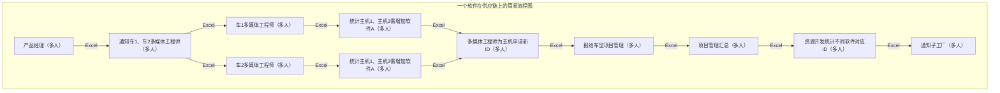
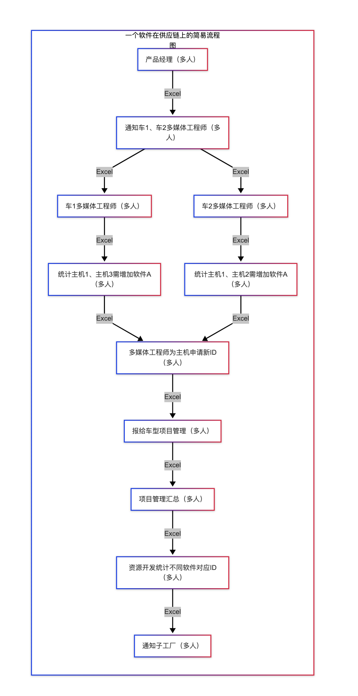

### Supply_Chain_Diary
将我在供应链轮岗半年的经历记录

### 最根本的问题

[雷军吐槽传统车企同质化,产品基本靠蒙](https://www.bilibili.com/video/BV1UmE5zHEUR/?spm_id_from=333.337.search-card.all.click)

    >上述是雷军吐槽传统车企的视频: 他认为传统车企大量同类同质化产品,产品线基本靠蒙.  笔者曾经是车企的供应链和研发线上的一员,我想从车企内部,特别
是供应链的角度看,大量车型对日常车企造成的影响

### 超级计算机,大量芯片
    >我们知道超级计算机是大量芯片堆积而成，但仅有芯片数量远远不够。芯片之间的数据传输效率才是决定性能的关键。如果互联带宽不足或延迟过高，整体算力就
会被严重限制。因此，超级计算机不仅要有强大的芯片，还需要高效的互连架构和优化的系统设计。
    同理, 由于大量不同的车型共同在一个车企后, 研发工作就变得特别困难。每一款车型都可能有不同的平台、零部件和技术方案，这不仅导致各部门之间的沟通协调难度大幅提升，还会造成资源分散、重复开发等问题。研发团队需要花费大量时间在需求对齐、技术兼容和项目管理上，极大地拉高了整体的沟通成本和研发成本。最终，企业的创新效率和市场响应速度都会受到影响，甚至可能影响产品质量和企业竞争力。
    
### 问题1: 很多奇特的岗位
    在我看到的领域内,看到许多奇特的岗位:1) 专门送合同的人员; 2) 专门盖章的人员  3) 专门供应商资料的人员  4) 专门修改仓库物料号的人员
.....  虽然这些岗位可以为社会提供了大量岗位需求, 同时呢?人也终生绑定在非常无聊低效无法进步的工作位置中,用流水线的方式工作. 更重要的是, 这
些工作的设计流程是流水线似的. 一个程序停了,这个工作流就停止,需要等待才能够完成
    笔者曾经遇到过这样的情况：一份合同在公司内部流转了半个月，最后才被印章管理人员发现不符合流程，结果整个合同流程不得不重新开始。

### 问题2: 研发过程完全被掣肘
    每做一个产品,要考虑对其他产品影响. 要考虑日后下放到别产品. 大量时间浪费在对齐,沟通,写文档记录....

### 问题3: 供应链的角度
    笔者处理过的: 因为供应商软件类的产品,是按照License 收费的, 大量产品线的情况下. 发生下列问题:
    1) 无法为一个产品提供一个准确的量纲预测,这样导致无法集中采购
    2) 沟通成本过高,同一款或者类似款在企业内部重复采购
    3) 过多的人,过长的流程, 中间肯定涉及人员流失, 不负责,疲惫. 这样导致连最基础的统计license 数量都无法顺利完成

-----------
笔者手头上发生过, 一个软件A 的License 的统计导致多支付一千万的事情.

这里画一个图, 介绍 软件A的采购后的环境

软件A 是放在主机中, 一个主机可能有很多不同的软件: 软件B,C,D...
同时, 主机被赋予一个物料号ID. 这里规定,  只要主机的软件变动了一次, 就必须
一个主机同时要对应不同的车( 车1, 车2, 车3  )

#### 一个软件在供应链上的简易流程图

---

#### 软件配置主数据表（示例）

| 主机ID | 软件A安装情况   | 软件B安装情况 | 芯片型号 | 车款   | 物料号   | 备注         |
|--------|----------------|--------------|----------|--------|----------|--------------|
| 主机1  | 已安装         | 未安装       | X123     | 车1    | 100001   |              |
| 主机2  | 计划OTA安装    | 已安装       | X123     | 车2    | 100002   |              |
| 主机3  | OTA已推送      | 已安装       | X456     | 车1    | 100003   |              |
| 主机4  | OTA安装失败    | 未安装       | X789     | 车3    | 100004   |              |
| 主机5  | 未安装         | 未安装       | X123     | 车2    | 100005   |              |
| 主机6  | OTA安装成功    | 已安装       | X456     | 车1    | 100006   |              |
| 主机7  | 已安装         | 未安装       | X789     | 车2    | 100007   |              |
| 主机8  | 未安装         | 已安装       | X123     | 车3    | 100008   |              |
| 主机9  | 已安装         | 已安装       | X456     | 车1    | 100009   |              |
| 主机10 | 未安装         | 未安装       | X789     | 车2    | 100010   |              |
| ...    | ...            | ...          | ...      | ...    | ...      | ...          |
| 主机50 | 已安装         | 已安装       | X123     | 车3    | 100050   |              |

#### 历史修改记录（示例）

- 2024年11月1日，李四在主机1上新增了软件A，状态由“未安装”变为“已安装”。
- 2024年11月2日，王五将主机1的物料号从100001变更为100002，并同步给了车2多媒体工程师。
- 2024年11月3日，李四在主机2上安装了软件B，状态由“未安装”变为“已安装”。
- 2024年11月4日，张三将主机3的芯片型号从X456更换为X789，更新后通知了资源开发部门。
- 2024年11月5日，李四在主机4上安装了软件A，状态由“未安装”变为“已安装”。
- 2024年12月10日，李四因人工失误，在主机1上重复操作，导致软件A被多次标记为“已安装”。
- 2024年12月11日，AI分析系统自动检测到主机1的软件A存在重复安装记录，建议相关人员核查。
- 2024年12月12日，张三根据AI建议，手动删除了主机1的重复安装记录。
- 2024年12月13日，财务部门在对账时发现主机1的License费用被多支付，初步估算损失高达一千万元。
- 2024年12月14日，AI分析追溯历史修改记录，定位到多支付的根本原因，并生成报告。
- 2024年12月15日，财务部门根据AI报告，成功追回了200万元损失。

> 由于流程环节繁多，数据全靠Excel人工传递和修改，最终导致主机1被重复统计，License费用多支付一千万。笔者通过AI分析历史修改记录，发现并纠正了重复项，最终为公司追回了200万损失。

